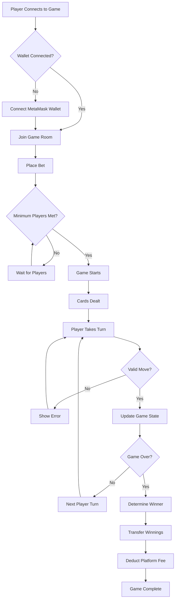

# Multiplayer UNO DApp 🎮

A decentralized multiplayer UNO game with betting, winner selection system, and platform fee. This DApp allows players to join UNO games, place bets, and compete to win rewards. Built on the Sepolia Test Network using Infura and Hardhat.

## 🚀 Game Flow



## ✨ Features

- 🎯 **Multiplayer UNO Game**: Play UNO with friends or other players in real-time
- 💰 **Betting System**: Players place bets, and the winner takes the pot (minus platform fee)
- 🏆 **Automated Winner Selection**: Smart contract determines the winner automatically
- 🔒 **Platform Fee**: Small fee deducted from the pot for platform maintenance
- 🌐 **Real-time Gameplay**: Instant updates using Socket.IO
- 🔗 **Blockchain Integration**: Secure betting and payouts on Sepolia testnet
- 👛 **MetaMask Integration**: Easy wallet connection and transaction signing

## 🛠️ Tech Stack

### Frontend
- **HTML5/CSS3**: Core web technologies
- **JavaScript**: Game logic and interactions
- **Socket.IO Client**: Real-time communication
- **Web3.js**: Blockchain interaction
- **MetaMask**: Wallet integration

### Backend
- **Node.js**: Runtime environment
- **Express.js**: Web framework
- **Socket.IO**: Real-time bidirectional communication
- **MongoDB**: Game state and user data storage

### Blockchain
- **Solidity**: Smart contract development
- **Hardhat**: Development framework
- **Sepolia Testnet**: Ethereum test network
- **Infura**: Blockchain node provider
- **OpenZeppelin**: Security-audited contract libraries

## 📋 Prerequisites

Before running this project, make sure you have:

- Node.js (v14 or higher)
- npm or yarn
- MetaMask browser extension
- Sepolia testnet ETH (for testing)
- MongoDB (local or cloud)

## ⚙️ Installation

1. **Clone the repository**
   ```bash
   git clone https://github.com/KoushikReddy9963/UnogameDApp.git
   cd UnogameDApp
   ```

2. **Install dependencies**
   ```bash
   npm install
   ```

3. **Set up environment variables**
   ```bash
   cp .env.example .env
   ```
   Edit `.env` file with your configuration:
   ```
   INFURA_PROJECT_ID=your_infura_project_id
   PRIVATE_KEY=your_wallet_private_key
   MONGODB_URI=your_mongodb_connection_string
   PORT=3000
   ```

4. **Compile smart contracts**
   ```bash
   npx hardhat compile
   ```

5. **Deploy contracts to Sepolia**
   ```bash
   npx hardhat run scripts/deploy.js --network sepolia
   ```

6. **Start the development server**
   ```bash
   npm start
   ```

## 🎮 How to Play

1. **Connect Wallet**: Click "Connect Wallet" to connect your MetaMask
2. **Join Game**: Enter a game room or create a new one
3. **Place Bet**: Set your bet amount (minimum required)
4. **Wait for Players**: Game starts when minimum players join
5. **Play UNO**: Follow standard UNO rules
6. **Win Rewards**: Winner gets the pot minus platform fee

## 🔧 Smart Contract Functions

### Core Functions
- `createGame(uint256 betAmount)`: Create a new game with betting
- `joinGame(uint256 gameId)`: Join an existing game
- `makeMove(uint256 gameId, string move)`: Make a move in the game
- `endGame(uint256 gameId, address winner)`: End game and distribute rewards
- `withdrawPlatformFees()`: Owner can withdraw accumulated fees

### Game Rules in Smart Contract
- Minimum bet amount enforcement
- Maximum players per game limit
- Winner validation
- Automatic fee calculation
- Secure fund handling

## 🔒 Security Features

- **Reentrancy Protection**: Using OpenZeppelin's ReentrancyGuard
- **Access Control**: Role-based permissions
- **Input Validation**: Comprehensive parameter checking
- **Safe Math**: Overflow/underflow protection
- **Pausable Contract**: Emergency stop functionality

## 🧪 Testing

Run the test suite:
```bash
# Run all tests
npm test

# Run specific test file
npx hardhat test test/UnoGame.test.js

# Run tests with coverage
npm run test:coverage
```

## 📊 Project Structure

```
UnogameDApp/
├── contracts/              # Smart contracts
│   ├── UnoGame.sol         # Main game contract
│   └── interfaces/         # Contract interfaces
├── scripts/                # Deployment scripts
├── test/                   # Test files
├── frontend/               # Frontend application
│   ├── css/               # Stylesheets
│   ├── js/                # JavaScript files
│   └── index.html         # Main HTML file
├── backend/                # Backend server
│   ├── routes/            # API routes
│   ├── models/            # Data models
│   └── server.js          # Main server file
├── hardhat.config.js       # Hardhat configuration
├── package.json           # Dependencies
└── README.md              # This file
```

## 🌐 Deployment

### Frontend Deployment (Vercel)
```bash
# Install Vercel CLI
npm i -g vercel

# Deploy
vercel --prod
```

### Backend Deployment (Heroku)
```bash
# Create Heroku app
heroku create your-app-name

# Deploy
git push heroku main
```

## 🔗 Contract Addresses (Sepolia)

- **UnoGame Contract**: `[Contract Address Here]`
- **Verified on Etherscan**: `[Etherscan Link Here]`

## 🤝 Contributing

1. Fork the repository
2. Create your feature branch (`git checkout -b feature/AmazingFeature`)
3. Commit your changes (`git commit -m 'Add some AmazingFeature'`)
4. Push to the branch (`git push origin feature/AmazingFeature`)
5. Open a Pull Request

## 📝 License

This project is licensed under the MIT License - see the [LICENSE](LICENSE) file for details.

## 🆘 Support

For support, email koushikreddy9963@example.com or create an issue in this repository.

## 🙏 Acknowledgments

- OpenZeppelin for secure smart contract libraries
- Hardhat team for the excellent development framework
- Socket.IO for real-time communication
- The Ethereum community for continuous innovation

---

**Built with ❤️ by [KoushikReddy9963](https://github.com/KoushikReddy9963)**
